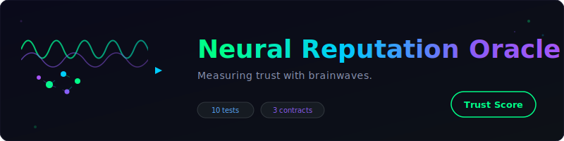

<p align="center">
  
</p>

<h1 align="center">Neural Reputation Oracle</h1>
<p align="center"><em>Measuring trust with brainwaves.</em></p>

<p align="center">
  
  
  
  
</p>

<p align="center">
  <a href="docs/how-it-works.html">Interactive Visualization</a> &nbsp;|&nbsp;
  <a href="docs/architecture.html">Contract Architecture</a>
</p>

---

## The Idea

What if we could measure **how carefully** a validator actually reviewed an agent -- not just what score they gave, but how engaged their brain was while doing it?

**Neural Reputation Oracle** processes simulated BCI (Brain-Computer Interface) signals from validators and converts them into on-chain **confidence scores**. Instead of trusting a validator's number at face value, we measure their cognitive state during the review:

- **Attention** -- Were they focused on the agent?
- **Engagement** -- Were they mentally invested in the evaluation?
- **Stress** -- Were they rushed or pressured?
- **Focus Duration** -- How long did they actually concentrate?
- **Cognitive Load** -- Were they overwhelmed or thinking clearly?

These signals feed into a weighted formula that produces a 0-100 confidence score, written immutably on-chain via `NeuralOracle.sol`.

---

## Architecture

```
                                                          ERC-8004
  BCI Signals ──> Neural Oracle Agent ──> NeuralOracle.sol ──> Validation Registry
       |                  |                      |                     |
  attention          ingest +               submitNeuro-          MockIdentity-
  engagement         analyze +              Validation()          Registry (ERC721)
  stress             classify +                  |                     +
  focus              write                  getNeuroScore()       MockReputation-
  cogLoad                                   getAverageScore()     Registry
```

**Flow:**
1. Validator reviews an agent while BCI device captures neural signals
2. Neural Oracle Agent ingests raw signals (attention, engagement, stress, focus, cognitive load)
3. Agent computes a weighted confidence score
4. Agent classifies the score (HIGH / MEDIUM / LOW)
5. Score is written on-chain to `NeuralOracle.sol` with a hash of the raw BCI data

---

## Confidence Formula

```
score = attention       * 0.30
      + engagement      * 0.25
      + (100 - stress)  * 0.20
      + focusNorm       * 0.15
      + (100 - cogLoad) * 0.10
```

Where `focusNorm = min(focusDuration / 60, 1) * 100`

### Classification

| Range   | Level    | Meaning |
|---------|----------|---------|
| 80-100  | **HIGH**   | Validator was focused, engaged, and calm -- score is trustworthy |
| 50-79   | **MEDIUM** | Validator was partially attentive -- score may have some bias |
| 0-49    | **LOW**    | Validator was distracted, rushed, or stressed -- score is unreliable |

---

## Agent Demo Output

```
╔══════════════════════════════════════════════════════════╗
║       NEURAL REPUTATION ORACLE                          ║
║       BCI signals → on-chain trust scores               ║
║       ingest → analyze → classify → write               ║
╚══════════════════════════════════════════════════════════╝

ℹ️  INFO    Deploying contracts...
🏗️  BOOT     Oracle agent registering on-chain identity...

════════════════════════════════════════════════════════════
📡 INGEST   Validator Alice reviewing Agent #1 (careful reviewer)
📡 INGEST   Signals: attention=94, engagement=91, stress=10, focus=52s, load=28
🧠 ANALYZE  Confidence = att×0.3 + eng×0.25 + (100-stress)×0.2 + focus×0.15 + (100-load)×0.1
🧠 ANALYZE  Score: 87/100
🏷️  CLASS   HIGH CONFIDENCE — validator was careful
📝 WRITE    Score 87 written to NeuralOracle for Agent #1

════════════════════════════════════════════════════════════
📡 INGEST   Validator Bob reviewing Agent #2 (rushed reviewer)
📡 INGEST   Signals: attention=25, engagement=19, stress=85, focus=5s, load=89
🧠 ANALYZE  Score: 20/100
🏷️  CLASS   LOW CONFIDENCE — validator was rushed
⚠️  ALERT   LOW confidence validation flagged
📝 WRITE    Score 20 written to NeuralOracle for Agent #2

════════════════════════════════════════════════════════════
📡 INGEST   Validator Charlie reviewing Agent #3 (distracted reviewer)
📡 INGEST   Signals: attention=48, engagement=38, stress=52, focus=16s, load=58
🧠 ANALYZE  Score: 45/100
🏷️  CLASS   LOW CONFIDENCE — validator was distracted
📝 WRITE    Score 45 written to NeuralOracle for Agent #3

════════════════════════════════════════════════════════════
📋 SUMMARY  Neural Oracle Results:
📋 SUMMARY    Agent #1: avg=87, validations=1
📋 SUMMARY    Agent #2: avg=20, validations=1
📋 SUMMARY    Agent #3: avg=45, validations=1
```

---

## Quick Start

```bash
# Install dependencies
npm install

# Compile contracts
npm run compile

# Run all 10 tests
npm run test

# Run the neural agent demo
npx hardhat run agent/neural-agent.ts

# Open interactive visualization
open docs/how-it-works.html
```

---

## Contracts

| Contract | Description |
|----------|-------------|
| `NeuralOracle.sol` | Core oracle -- stores confidence scores per agent+validator, computes aggregates |
| `MockIdentityRegistry.sol` | ERC721-based agent identity registry |
| `MockReputationRegistry.sol` | Feedback-based reputation system |

---

## Hackathon

**PL_Genesis** -- Neurotechnology and Brain-Computer Interfaces track

This project explores how BCI signals can add a layer of trust verification to autonomous agent ecosystems. By measuring cognitive state during validation, we can distinguish between careful, engaged reviewers and those who rubber-stamp approvals without genuine consideration.

---

## Deployed Contracts

| Network | Contract | Address |
|---------|----------|---------|
| Base Sepolia | NeuralOracle | `TBD` |
| Base Sepolia | MockIdentityRegistry | `TBD` |
| Base Sepolia | MockReputationRegistry | `TBD` |

---

## Tech Stack

- **Solidity** 0.8.27 (cancun EVM, OpenZeppelin 5.x)
- **Hardhat** with TypeScript
- **Target**: Base Sepolia
- **Agent harness**: claude-code (claude-opus-4-6)

---

<p align="center"><sub>Built with brainwaves and blockchains.</sub></p>
